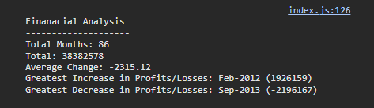

# console-finance

## Description
For this week JavaScript basics was introduced and thus a new challenge is on the table. I had to come up with a algorithm to analyze the financial records of a company. 

In order to tackle this problem, I've used objects, methods, arrays and indexing in order to create a algorithm that deconstruct the dataset to find the required information and display it on the console.

## Screenshots

## Deployed URL
